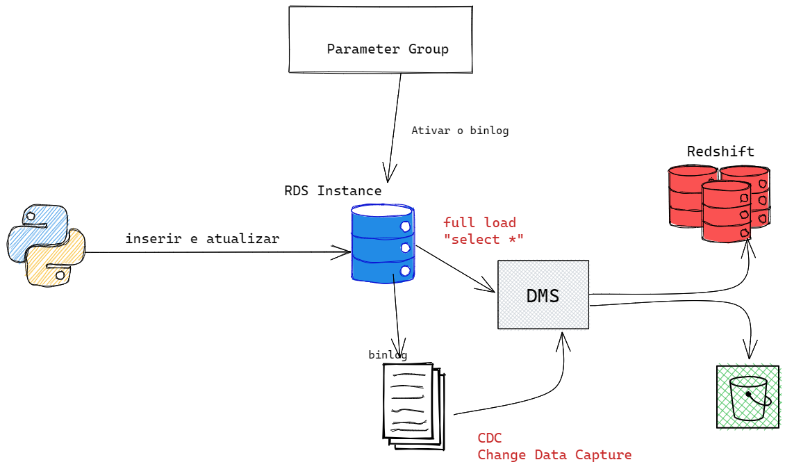

# Projeto de Engenharia de dados com AWS

Esse projeto visa reproduzir situações que fazem parte do dia a dia de Engenheiro de dados.
- Criar uma instância do Postgres no RDS (usando a free-tier)
- Desenvolver código Python para popular o DB com dados fake
- Usar o DMS para replicar os dados:
  - Para o S3 
  - Para o Redshift (ou outra instância de banco de dados)
## Escopo

 